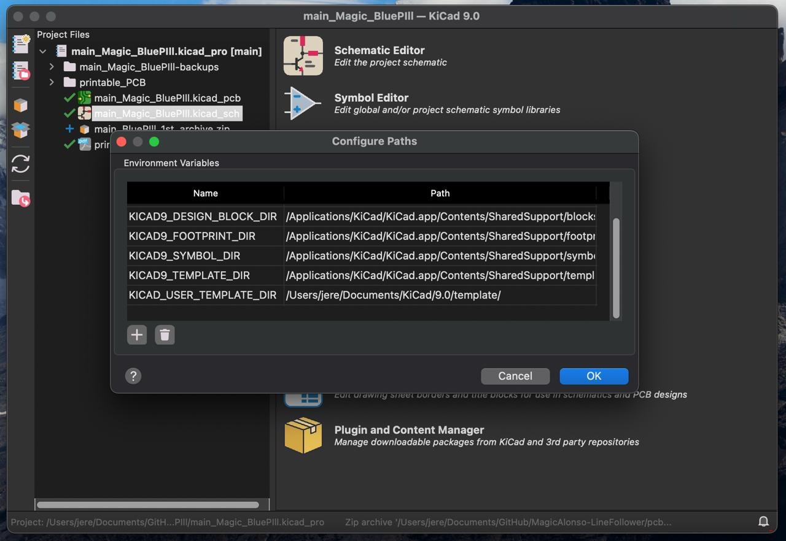

# Hola!
- Esta es mi pequeña librería de KiCad que uso para mis proyectos. Contiene una variedad de huellas totalmente mezclada, algunas hechas por mí y otras no tanto.

## *Importante*
- Para poder tener los modelos 3D configurados es necesario crear una variable de dirección (path variable) que apunte a donde tenés clonado el repo.

