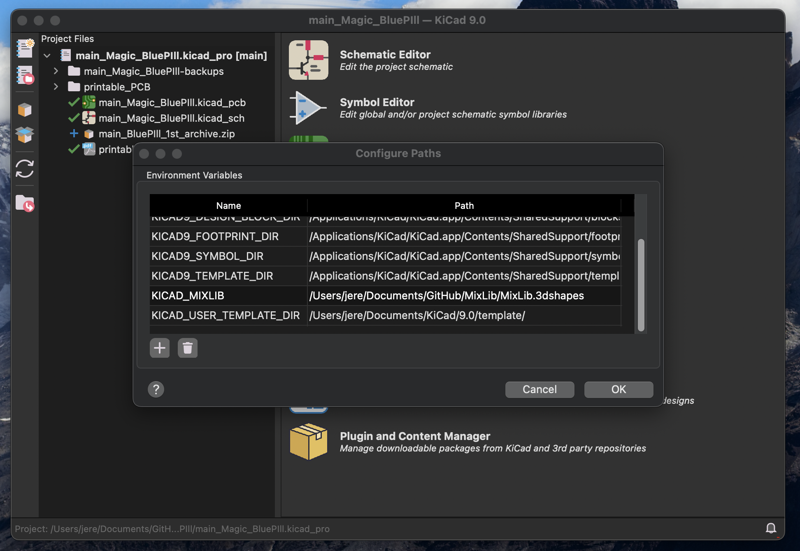

# Hola!
- Esta es mi pequeña librería de KiCad que uso para mis proyectos. Contiene una variedad de huellas totalmente mezclada, algunas hechas por mí y otras no tanto.

## *Importante*
- Para facilitar la configuración de los modelos 3D podes crear una variable de dirección (path variable) que apunte a la carpeta *MixLib.3dshapes*, dentro del repo clonado. Así:

