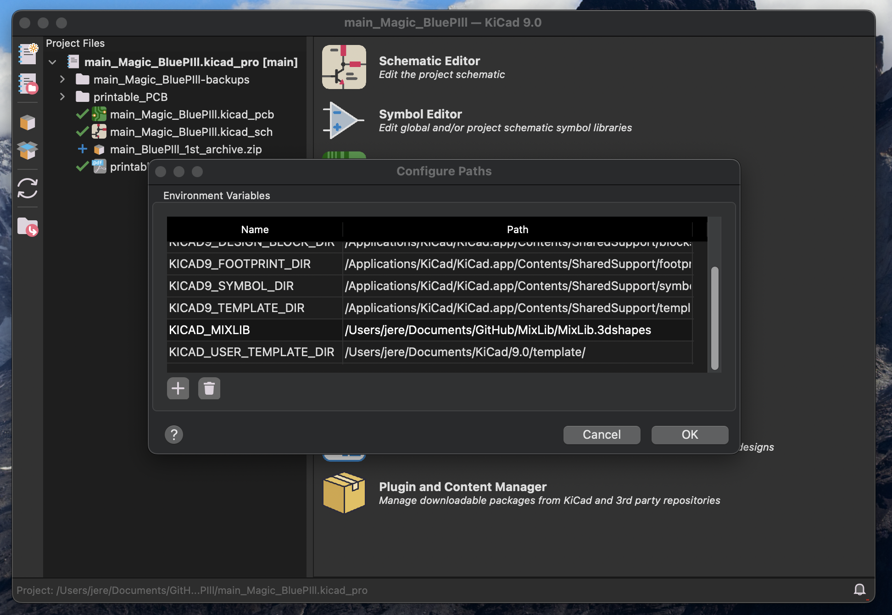

# Hola!
- Esta es mi pequeña librería de KiCad que uso para mis proyectos. Contiene una variedad de huellas totalmente mezclada, algunas hechas por mí y otras no tanto.

## Importante
- Para facilitar la configuración de los modelos 3D se puede crear una variable de dirección (path variable) apuntando a la carpeta **MixLib.3dshapes** dentro del repositorio local. Así:

